# distilled-cloudflare

Effect-native Cloudflare SDK generated from the [Cloudflare OpenAPI spec](https://github.com/cloudflare/api-schemas).

## COMMANDS

```bash
bun generate                              # Generate all services
bun generate --service r2                 # Generate single service
bun generate --fetch                      # Fetch latest spec first
bun vitest run ./test/services/r2.test.ts # Run tests
bun tsc -b                                # Type check (run before committing)
```

## AGENT TESTING PROTOCOL

This section defines the **mandatory** process for AI agents adding comprehensive test coverage to a service.

### Protocol Overview

```mermaid
flowchart LR
    A[1. IDENTIFY] --> B[2. PLAN]
    B --> C[3. BATCH]
    C --> D[4. IMPLEMENT]
    D --> E[5. DIAGNOSE]
    E --> F{All tests pass?}
    F -->|No| D
    F -->|Yes| G{More batches?}
    G -->|Yes| C
    G -->|No| H[✅ Complete]
```



### Step 1: Identify Services Needing Tests

Enumerate all operations for the target service and identify which need tests:

```bash
# List all exported functions for a service
grep "^export const" src/services/{service}.ts | head -100

# Check existing test coverage
grep "describe\|test(" test/services/{service}.test.ts 2>/dev/null || echo "No tests yet"
```

For each operation, determine:
- Does it have a happy path test?
- Does it have error case tests?
- What error cases are possible?

### Step 2: Create Test Plan

Document ALL operations with their happy path and error cases **before writing any code**:

```markdown
## Test Plan: {Service}

### Operation: createBucket
**Happy Path:** Create bucket with valid name, verify bucket is created
**Error Cases:**
| Error Tag | Trigger | Expected? |
|-----------|---------|-----------|
| BucketAlreadyExists | Create bucket with existing name | ❌ Discover |
| ValidationError | Create bucket with invalid name | ❌ Discover |

### Operation: deleteBucket  
**Happy Path:** Delete existing bucket
**Error Cases:**
| Error Tag | Trigger | Expected? |
|-----------|---------|-----------|
| NoSuchBucket | Delete non-existent bucket | ✅ In spec |
| BucketNotEmpty | Delete bucket with objects | ❌ Discover |
```

**Expected?** column indicates:
- ✅ In spec - Error already defined in `spec/{service}.json`
- ❌ Discover - Error needs to be discovered and added

### Step 3: Batch Tests

Group tests into batches of ~3-5 operations for manageable iteration:

```markdown
## Batch 1: Bucket CRUD
- createBucket
  - happy: Create bucket, verify bucket exists
  - error: BucketAlreadyExists - create bucket with existing name
  - error: ValidationError - create bucket with invalid name
- getBucket
  - happy: Get existing bucket metadata
  - error: NoSuchBucket - get non-existent bucket
- deleteBucket
  - happy: Delete existing empty bucket
  - error: NoSuchBucket - delete non-existent bucket
  - error: BucketNotEmpty - delete bucket with objects

## Batch 2: Bucket Configuration  
- getBucketCorsPolicy
  - happy: Get CORS policy from bucket with CORS configured
  - error: NoSuchBucket - get CORS from non-existent bucket
  - error: NoCorsConfiguration - get CORS from bucket without CORS
- putBucketCorsPolicy
  - happy: Set CORS policy on bucket
  - error: NoSuchBucket - set CORS on non-existent bucket
- deleteBucketCorsPolicy
  - happy: Delete CORS policy from bucket
  - error: NoSuchBucket - delete CORS from non-existent bucket
  - error: NoCorsConfiguration - delete CORS from bucket without CORS
```

### Step 4: Implement Tests

For each batch:

1. **Write all tests** (happy path + error cases)
2. **Type-check**: `bun tsc -b`
3. **Fix type errors** before running tests
4. **Run tests**: `bun vitest run ./test/services/{service}.test.ts`

### Step 5: Diagnose Failures

When tests fail, categorize the issue:

| Failure Type | Symptom | Fix |
|--------------|---------|-----|
| **Spec Bug** | `Schema decode failed` | Patch `spec/openapi.patch.jsonc` |
| **Generator Bug** | Type mismatch between interface and schema | Fix `scripts/generate-clients.ts` |
| **Client Bug** | Incorrect request/response handling | Fix `src/client/*.ts` |
| **Missing Error** | `UnknownCloudflareError` | Add to `spec/{service}.json` |

#### For UnknownCloudflareError:

1. Extract the error code from the failure message
2. Add error to `spec/{service}.json`:

```json
{
  "errors": {
    "NewErrorTag": { "code": 12345 }
  },
  "operations": {
    "operationName": {
      "errors": { "NewErrorTag": {} }
    }
  }
}
```

3. Regenerate: `bun generate --service {service}`
4. Re-run tests

### Step 6: Iterate Until Complete

```mermaid
flowchart TD
    A[Test Fails] --> B{Failure Type?}
    B -->|UnknownCloudflareError| C["Add to spec/service.json"]
    B -->|Schema decode failed| D[Patch openapi.patch.jsonc]
    B -->|Type error| E[Fix generator or test]
    B -->|Needs user action| F["🛑 STOP & Request Help"]
    C --> G[Regenerate]
    D --> G
    E --> G
    G --> H[Re-run tests]
    H --> I{Pass?}
    I -->|No| A
    I -->|Yes| J[Next test/batch]
```



**Rules:**
- ❌ Do NOT mark tests as skipped or todo
- ❌ Do NOT move to next batch until current batch passes
- ✅ Iterate until 100% operation coverage
- ⚠️ EXCEPTION: Skip account-level destructive operations (e.g., `deleteSubdomain1`, `createSubdomain`) that permanently affect the entire account and cannot be safely tested

**Completion Criteria:**
- Every operation has at least one happy path test
- Every operation has error case tests for all discoverable errors
- All tests pass: `bun vitest run ./test/services/{service}.test.ts`
- Type-check passes: `bun tsc -b`

### When to Request Intervention

Stop and ask for user help ONLY when:

| Situation | Action |
|-----------|--------|
| **Missing credentials** | Request user add env vars |
| **Rate limiting** | Request user wait or increase limits |
| **Account-level restrictions** | Request user enable feature in dashboard |
| **Ambiguous API behavior** | Ask for clarification on expected behavior |
| **Breaking change to generator** | Ask for approval before modifying generator |

Do NOT stop for:
- `UnknownCloudflareError` → Add to spec and continue
- `Schema decode failed` → Patch spec and continue
- Type errors → Fix and continue
- Flaky tests → Add retry logic and continue

### Example: Full Protocol Execution

```markdown
# Protocol Execution: R2 Service

## Step 1: Identified 12 operations, 4 have tests

## Step 2: Test Plan
[Documented all 12 operations with expected happy paths and errors]

## Step 3: Batches
- Batch 1: createBucket, getBucket, deleteBucket, listBuckets
- Batch 2: *CorsPolicy operations
- Batch 3: *LifecycleConfiguration operations

## Step 4-6: Implementation Log

### Batch 1
- ✅ createBucket happy path - PASS
- ❌ createBucket BucketAlreadyExists - UnknownCloudflareError code 10007
  → Added to spec/r2.json, regenerated, now PASS
- ✅ getBucket happy path - PASS
- ✅ getBucket NoSuchBucket - PASS (already in spec)
...

### Batch 2
...

## Final Result: 12/12 operations covered, 28 tests total
```

---

## TDD WORKFLOW

The Cloudflare OpenAPI spec is incomplete. Tests reveal three types of issues:

| Error Type | Symptom | Fix Location |
|------------|---------|--------------|
| `UnknownCloudflareError` | Undocumented error code | `spec/{service}.json` |
| `Schema decode failed` | Response doesn't match spec | `spec/openapi.patch.jsonc` |
| Type error in test | Generator bug | `scripts/generate-clients.ts` |

### The Complete Loop

```mermaid
flowchart TD
    subgraph Phase0["PHASE 0: PLAN"]
        P0[Document for each API:<br/>• Happy path test<br/>• Error cases with expected tags<br/>• Whether tags exist in spec]
    end
    
    subgraph Phase1["PHASE 1: WRITE TESTS"]
        P1[Write happy path AND error path tests]
    end
    
    subgraph Phase2["PHASE 2: CHECK LSP ERRORS"]
        P2[Run type checker]
        P2 --> P2a{Type errors?}
        P2a -->|Wrong args| P2b[Fix the test]
        P2a -->|Missing required field| P2c[Patch OpenAPI spec]
        P2a -->|Record instead of union| P2d[Fix generator]
        P2b --> P2e[Regenerate & repeat]
        P2c --> P2e
        P2d --> P2e
        P2a -->|No errors| P3
    end
    
    subgraph Phase3["PHASE 3: RUN TESTS"]
        P3[Run tests]
        P3 --> P3a{Result?}
        P3a -->|UnknownCloudflareError| P3b["Add to spec/service.json"]
        P3a -->|Schema decode failed| P3c[Patch openapi.patch.jsonc]
        P3a -->|Pass| P3d[Move to next test]
        P3b --> P3e[Regenerate & repeat]
        P3c --> P3e
        P3e --> P3
    end
    
    Phase0 --> Phase1
    Phase1 --> Phase2
    P2e --> P2
```



---

## PHASE 0: PLAN API TEST COVERAGE

Before writing tests, document what needs testing for each API:

```markdown
### API: putScriptSecret

- happy: Create worker, put secret, verify secret appears in list
- error: WorkerNotFound - put secret on non-existent worker (in spec)
- error: InvalidSecretName - use invalid characters in name (discover)

**Notes:**
- Response omits `text` field (writeOnly)
```

This planning reveals:
1. Which error tags already exist in `spec/{service}.json`
2. Which need to be discovered via testing
3. Special behaviors to watch for (writeOnly fields, etc.)

---

## PHASE 1: WRITE TESTS

Create isolated tests using `withXxx` helpers:

```typescript
const withBucket = <A, E, R>(
  name: string,
  fn: (bucket: string) => Effect.Effect<A, E, R>,
) =>
  cleanup(name).pipe(
    Effect.andThen(R2.createBucket({ account_id: accountId(), name })),
    Effect.andThen(fn(name)),
    Effect.ensuring(cleanup(name)),
  );

test("get lifecycle configuration", () =>
  withBucket("itty-cf-r2-lifecycle", (bucket) =>
    Effect.gen(function* () {
      const result = yield* R2.getBucketLifecycleConfiguration({
        account_id: accountId(),
        bucket_name: bucket,
      });
      expect(result.result).toBeDefined();
    }),
  ));
```

**Naming:** Use `itty-cf-{service}-{test}` — deterministic, no random suffixes.

---

## STEP 2: RUN THE TEST

```bash
bun vitest run ./test/services/r2.test.ts -t "lifecycle"
```

Two failure modes:

### Failure A: `UnknownCloudflareError`

```
(FiberFailure) UnknownCloudflareError: The CORS configuration does not exist.
```

→ Go to [Step 3A: Catalog the Error](#step-3a-catalog-the-error)

### Failure B: `Schema decode failed`

```
(FiberFailure) CloudflareHttpError: { "status": 200, "statusText": "Schema decode failed", "body": "{...}" }
```

→ Go to [Step 3B: Patch the Schema](#step-3b-patch-the-schema)

---

## STEP 3A: ADD THE ERROR

When you see `UnknownCloudflareError`, the API returned an error code not defined in `spec/{service}.json`.

### Extract the error code

Run with DEBUG to see the full response:

```bash
DEBUG=1 bun vitest run ./test/services/r2.test.ts -t "CORS"
```

Or log it in the test:

```typescript
const result = yield* someOperation().pipe(Effect.exit);
console.log(JSON.stringify(result, null, 2));
// Shows: { "code": 10059, "message": "The CORS configuration does not exist." }
```

### Define the error in spec/{service}.json

Errors are defined per-service with matching conditions. Edit `spec/{service}.json` (e.g., `spec/r2.json`):

```json
{
  "errors": {
    "NoSuchBucket": { "code": 10006, "status": 404 },
    "NoCorsConfiguration": { "code": 10059 },
    "ValidationError": { "code": 100021 }
  },
  "operations": {
    "getBucketCorsPolicy": {
      "errors": { "NoSuchBucket": {}, "NoCorsConfiguration": {} }
    },
    "deleteBucketCorsPolicy": {
      "errors": { "NoSuchBucket": {}, "NoCorsConfiguration": {} }
    }
  }
}
```

**Error matching supports:**
- `code` - Single Cloudflare error code
- `codes` - Array of codes that map to the same error
- `status` - HTTP status code (optional, for disambiguation)
- `message` - Substring match on error message (optional)

**Service-level vs operation-level:**
- Define errors at the service level with their matching conditions
- Reference errors by name at the operation level with `{}` to use defaults
- Override matching at the operation level: `{ "NoSuchBucket": { "code": 12345 } }`

**Important:** Use the **generated function name** (check `src/services/{service}.ts`), not the OpenAPI operationId.

### Regenerate

```bash
bun generate --service r2
```

→ Go to [Step 4: Update the Test](#step-4-update-the-test)

---

## STEP 3B: PATCH THE SCHEMA

When you see `Schema decode failed`, the API response doesn't match the OpenAPI spec.

### Identify the mismatch

The error body shows the actual response. Compare with the generated schema in `src/services/{service}.ts`.

Common issues:

| Problem | Example |
|---------|---------|
| Enum case mismatch | API returns `"WNAM"`, spec has `"wnam"` |
| Required field missing | Spec requires `prefix`, API returns `{}` |
| Null not allowed | API returns `null`, spec expects object |
| Missing endpoint | API exists but not in spec |

### Add a JSON Patch

Edit `spec/openapi.patch.jsonc`. **Every patch MUST have a comment.**

**JSON Pointer escaping:** `/` → `~1`, `~` → `~0`

Example: `/accounts/{account_id}/r2` → `/paths/~1accounts~1{account_id}~1r2`

#### Fix enum values

```jsonc
// R2: Add uppercase location enum values.
//
// Problem: API returns uppercase (WNAM), spec only has lowercase (wnam).
// Discovered: Schema decode failed on createBucket response.
{
  "op": "replace",
  "path": "/components/schemas/r2_bucket_location/enum",
  "value": ["apac", "eeur", "enam", "weur", "wnam", "oc", "APAC", "EEUR", "ENAM", "WEUR", "WNAM", "OC"]
}
```

#### Remove required constraint

```jsonc
// R2: Make conditions optional in lifecycle rules.
//
// Problem: Spec requires 'conditions', but API returns rules with empty conditions.
// Discovered: Schema decode failed on getBucketLifecycleConfiguration.
{
  "op": "replace",
  "path": "/components/schemas/r2_lifecycle-rule/required",
  "value": ["id", "enabled"]
}
```

#### Remove nested required

```jsonc
// R2: Remove prefix requirement from conditions.
//
// Problem: Spec requires conditions.prefix, but API returns conditions: {}.
// Discovered: Schema decode failed on getBucketLifecycleConfiguration.
{
  "op": "remove",
  "path": "/components/schemas/r2_lifecycle-rule/properties/conditions/required"
}
```

#### Allow null values

```jsonc
// KV: Allow null result in delete responses.
//
// Problem: API returns result: null, but spec expects object.
// Discovered: Schema decode failed on deleteKeyValuePair.
{
  "op": "replace",
  "path": "/components/schemas/workers-kv_api-response-common-no-result/allOf/1/properties/result",
  "value": {
    "oneOf": [
      { "type": "null" },
      { "type": "object" }
    ]
  }
}
```

#### Add undocumented endpoint

```jsonc
// Containers: Add list applications endpoint (undocumented).
//
// Problem: Containers API not in OpenAPI spec.
// Discovered: Reverse-engineered from Cloudflare dashboard.
{
  "op": "add",
  "path": "/paths/~1accounts~1{account_id}~1containers~1applications",
  "value": {
    "get": {
      "operationId": "listContainerApplications",
      "tags": ["Containers"],
      "parameters": [
        { "name": "account_id", "in": "path", "required": true, "schema": { "type": "string" } }
      ],
      "responses": {
        "200": { "content": { "application/json": { "schema": { "type": "object" } } } }
      }
    }
  }
}
```

### Regenerate

```bash
bun generate --service r2
```

→ Go to [Step 4: Update the Test](#step-4-update-the-test)

---

## STEP 3C: FIX THE GENERATOR

Sometimes the issue isn't the OpenAPI spec — it's how we generate code from it. These require fixes to `scripts/generate-clients.ts`.

### Symptoms of generator bugs

| Symptom | Cause | Fix |
|---------|-------|-----|
| `body: Record<string, unknown>` when it should be a union | `oneOf` not handled in `type: "object"` case | Add `oneOf` check before returning `Schema.Struct({})` |
| `A \| B[]` instead of `(A \| B)[]` | Array of union types not parenthesized | Wrap union types in parentheses for array notation |
| Schema decode fails on response with missing field | `writeOnly` property treated as required | Make `writeOnly` properties optional in schema |
| Interface type differs from Schema | `schemaToTsType` and `generateSchemaCode` diverge | Apply same fix to both functions |

### Generator fix workflow

1. **Identify the root cause** - Is it a spec issue or generator issue?
   - Spec issue: The OpenAPI spec is wrong → patch `openapi.patch.jsonc`
   - Generator issue: We're not handling a valid OpenAPI pattern → fix generator

2. **Fix both type generation AND schema generation**
   - `schemaToTsType()` - Generates TypeScript interface types
   - `generateSchemaCode()` - Generates Effect Schema code
   - These MUST stay in sync

3. **Regenerate and verify**
   ```bash
   bun generate --service {service}
   # Check the generated types in src/services/{service}.ts
   # Run tests to verify runtime behavior
   ```

### Example: Fixing oneOf in object types

The OpenAPI spec:
```json
{
  "type": "object",
  "oneOf": [
    { "$ref": "#/components/schemas/secret_text" },
    { "$ref": "#/components/schemas/secret_key" }
  ]
}
```

**Before fix:** Generated `Schema.Struct({})` and `Record<string, unknown>`
**After fix:** Generated `Schema.Union(...)` and `{ ... } | { ... }`

Fix in `generateSchemaCode()`:
```typescript
case "object":
  if (s.properties) { ... }
  // ADD: Check for oneOf before returning empty struct
  if (s.oneOf && s.oneOf.length > 0) {
    return `Schema.Union(${s.oneOf.map(m => generateSchemaCode(...)).join(", ")})`;
  }
  return "Schema.Struct({})";
```

---

## STEP 4: UPDATE THE TEST

After patching, update tests to use typed errors:

```typescript
test("NoCorsConfiguration error on fresh bucket", () =>
  withBucket("itty-cf-r2-no-cors", (bucket) =>
    R2.getBucketCorsPolicy({
      account_id: accountId(),
      bucket_name: bucket,
    }).pipe(
      Effect.matchEffect({
        onSuccess: () => Effect.die("Expected NoCorsConfiguration"),
        onFailure: (error) =>
          Effect.gen(function* () {
            expect(error._tag).toBe("NoCorsConfiguration");
          }),
      }),
    ),
  ));
```

---

## STEP 5: REPEAT

Run tests again. If new failures appear, go back to Step 2.

```bash
bun vitest run ./test/services/r2.test.ts
```

---

## KEY FILES

| File | Purpose |
|------|---------|
| `spec/{service}.json` | Error definitions and per-operation error assignments |
| `spec/openapi.patch.jsonc` | RFC 6902 JSON Patches for spec bugs |
| `src/services/{service}.ts` | Generated client (DO NOT EDIT) |
| `src/client/response-parser.ts` | Parses responses and matches errors using trait annotations |
| `src/traits.ts` | Schema annotations for HTTP bindings and error matching |
| `test/services/{service}.test.ts` | Tests that drive discovery |

---

## SERVICE SPEC FORMAT

Each service has a `spec/{service}.json` that defines errors and their matching conditions:

```json
{
  "errors": {
    "NoSuchBucket": { "code": 10006, "status": 404 },
    "NoCorsConfiguration": { "code": 10059 },
    "QueueNotFound": { "codes": [11000, 10004], "status": 404 },
    "ValidationError": { "code": 100021 }
  },
  "operations": {
    "getBucket": {
      "errors": { "NoSuchBucket": {} }
    },
    "createQueue": {
      "errors": { "ValidationError": {}, "QueueAlreadyExists": { "code": 10003 } }
    }
  }
}
```

**Error matcher fields:**
- `code` — Single Cloudflare error code
- `codes` — Array of codes (use when multiple codes map to same error)
- `status` — HTTP status code (helps disambiguate)
- `message` — Substring match on error message

**Matching priority:** code + status + message > code + status > code only

---

## JSON PATCH FORMAT

`spec/openapi.patch.jsonc` uses RFC 6902 JSON Patch in JSONC (allows comments).

| Operation | Use Case |
|-----------|----------|
| `add` | New paths, schemas, properties |
| `replace` | Fix enums, required arrays, property types |
| `remove` | Delete incorrect constraints |

**Comment requirement:** Every patch must explain what it fixes and how the issue was discovered.

---

## TEST PATTERNS

### Test Organization Convention

**Tests are organized by API operation, not by feature or priority.** Each API gets its own `describe` block containing both happy path and error tests:

```typescript
describe("Workers", () => {
  // Each API operation gets its own describe block
  describe("listWorkers", () => {
    test("happy path - lists workers in account", () =>
      Effect.gen(function* () {
        const result = yield* Workers.listWorkers({ account_id: accountId() });
        expect(result.result).toBeDefined();
        expect(Array.isArray(result.result)).toBe(true);
      }));
    
    // Error tests for this specific API go in the same describe
    test("error - returns empty array for valid account", () =>
      // ... error case tests
    );
  });

  describe("getWorkerSettings", () => {
    test("happy path - gets settings for existing worker", () =>
      withWorker("itty-cf-workers-settings", (scriptName) =>
        Effect.gen(function* () {
          const settings = yield* Workers.getWorkerSettings({
            account_id: accountId(),
            script_name: scriptName,
          });
          expect(settings.result).toBeDefined();
        }),
      ));

    test("error - WorkerNotFound for non-existent worker", () =>
      Workers.getWorkerSettings({
        account_id: accountId(),
        script_name: "non-existent-worker-xyz",
      }).pipe(
        Effect.flip,
        Effect.map((e) => expect(e._tag).toBe("WorkerNotFound")),
      ));
  });
});
```

**Key principles:**
1. **One describe per API** - All tests for `listWorkers` go under `describe("listWorkers")`
2. **Happy path first** - Start with the success case
3. **Error cases second** - Follow with error scenarios for the same API
4. **Use `withXxx` helpers** - Create resources with deterministic names and `Effect.ensuring` for cleanup
5. **Group related APIs** - When APIs are tightly coupled (e.g., `createWorker`/`deleteWorker`), they can share a describe

### Resource lifecycle helper

```typescript
const withBucket = <A, E, R>(
  name: string,
  fn: (bucket: string) => Effect.Effect<A, E, R>,
) =>
  cleanup(name).pipe(
    Effect.andThen(createBucket({ name })),
    Effect.andThen(fn(name)),
    Effect.ensuring(cleanup(name)),
  );

const cleanup = (name: string) =>
  deleteBucket({ bucket_name: name }).pipe(Effect.ignore);
```

### Error expectation

```typescript
test("NoSuchBucket on non-existent", () =>
  R2.getBucket({ account_id: accountId(), bucket_name: "does-not-exist" }).pipe(
    Effect.flip,
    Effect.map((e) => expect(e._tag).toBe("NoSuchBucket")),
  ));
```

### Naming convention

- `itty-cf-{service}-{testname}`
- Deterministic — same on every run
- Enables cleanup of leftovers from crashed tests

---

## ADDING A NEW SERVICE

1. Generate: `bun generate --fetch --service myservice`
2. Write tests in `test/services/myservice.test.ts`
3. Run tests, discover failures
4. For `UnknownCloudflareError`: catalog in `spec/myservice.json`
5. For `Schema decode failed`: patch in `openapi.patch.jsonc`
6. For type errors: fix `scripts/generate-clients.ts`
7. Regenerate: `bun generate --service myservice`
8. Repeat until all tests pass

---

## COMPREHENSIVE TEST COVERAGE WORKFLOW

When adding full test coverage to an existing service, follow this systematic approach:

### Step 1: Enumerate all APIs

```bash
# List all exported functions
grep "^export const" src/services/{service}.ts | head -100
```

### Step 2: Cross-reference with existing tests

Check which APIs already have tests:
```bash
grep "describe(" test/services/{service}.test.ts
```

### Step 3: Plan test cases for each API

For each API, document:

```markdown
### API: createDeployment

**Happy Path:**
- Create worker with version, create deployment, verify deployment ID returned

**Error Cases:**
| Error Tag | Trigger | In spec? |
|-----------|---------|----------|
| WorkerNotFound | Deploy non-existent worker | ✅ |
| InvalidVersionId | Use malformed version UUID | ❌ |

**Request Schema Issues:**
- Body requires `strategy` and `versions` but spec incorrectly marks response fields as required
```

### Step 4: Organize tests by API operation

**Each API operation gets its own `describe` block** containing both happy path and error tests:

```typescript
describe("createDeployment", () => {
  test("happy path - creates deployment", () =>
    withWorker("itty-cf-workers-deployment", (scriptName) =>
      Effect.gen(function* () {
        // ... happy path test
      }),
    ));

  test("error - WorkerNotFound for non-existent worker", () =>
    Workers.createDeployment({
      // ... trigger error condition
    }).pipe(
      Effect.flip,
      Effect.map((error) => {
        expect(error._tag).toBe("WorkerNotFound");
      }),
    ));
});
```

### Step 5: Implement iteratively

For each API:

1. **Add describe block** for the API operation
2. **Add happy path test** first
3. **Add error tests** for each error case
4. **Check LSP errors** (`ReadLints` tool)
5. **Fix type issues**:
   - Wrong test args → Fix test
   - Spec bug → Patch `openapi.patch.jsonc`
   - Generator bug → Fix `generate-clients.ts`
6. **Regenerate**: `bun generate --service {service}`
7. **Run tests**: `bun vitest run ./test/services/{service}.test.ts -t "apiName"`
8. **Handle failures**:
   - `UnknownCloudflareError` → Add to `spec/{service}.json`
   - `Schema decode failed` → Patch `openapi.patch.jsonc`
9. **Verify tests pass** before moving to next API

### Step 6: Final verification

```bash
# Run all tests for the service
bun vitest run ./test/services/{service}.test.ts

# Type check
bun tsc -b
```

---

## ARCHITECTURE

```
OpenAPI Spec + Patches → Generator → src/services/*.ts → Runtime
        ↓                    ↓              ↓               ↓
spec/openapi.patch.jsonc  spec/{service}.json  Schemas + Traits  Response Parser
```

**Generator:** `scripts/generate-clients.ts`
1. Loads spec from `.cache/openapi.json` (or fetches)
2. Applies patches from `spec/openapi.patch.jsonc`
3. Loads error definitions from `spec/{service}.json`
4. Groups operations by service
5. Generates Effect Schema request/response types with trait annotations
6. Outputs to `src/services/{service}.ts`

**Traits:** HTTP bindings and error matching as Schema annotations

| Trait | Purpose |
|-------|---------|
| `T.HttpPath(name)` | Path parameter |
| `T.HttpQuery(name)` | Query parameter |
| `T.HttpHeader(name)` | Header |
| `T.HttpBody()` | JSON body |
| `T.HttpFormData()` | Multipart form-data request |
| `T.HttpMultipartResponse()` | Multipart form-data response (returns `FormData`) |
| `T.HttpErrorCode(code)` | Match error by single code |
| `T.HttpErrorCodes([...])` | Match error by multiple codes |
| `T.HttpErrorStatus(status)` | Match error by HTTP status |
| `T.HttpErrorMessage(pattern)` | Match error by message substring |

**Response Parser:** `src/client/response-parser.ts`
1. Checks for multipart response (returns `FormData` directly)
2. Parses JSON response envelope `{ success, errors, result }`
3. On error, iterates error schemas and reads trait annotations
4. Matches error by code/status/message priority
5. Instantiates typed error class via `Schema.decodeUnknown`

---

## ENVIRONMENT

```bash
# Required
CLOUDFLARE_API_TOKEN=xxx
CLOUDFLARE_ACCOUNT_ID=xxx

# Optional (for zone-scoped tests)
CLOUDFLARE_ZONE_ID=xxx

# Download from Doppler
bun run download:env
```

---

## SERVICE NOTES

**Queues:**
- Create `http_pull` consumer before pulling messages
- Function names: `create`, `get_`, `delete_`, `update`

**R2:**
- Location enum has uppercase/lowercase variants
- Fresh buckets return `NoCorsConfiguration` (not 404)

**Workers:**
- Upload via FormData with metadata blob
- `getContent` returns `FormData` with worker modules as `File` entries
- Workflows require a worker that exports Workflow class

---

## MULTIPART RESPONSES

Some APIs return `multipart/form-data` instead of JSON (e.g., downloading worker scripts).

These are automatically detected and return `FormData`:

```typescript
const formData = yield* Workers.getContent({
  account_id: accountId(),
  script_name: "my-worker",
});

// Iterate all modules
for (const [name, file] of formData.entries()) {
  const content = yield* Effect.promise(() => (file as File).text());
  console.log(name, content);
}
```

The generator detects `multipart/form-data` response content type and:
1. Generates `type XxxResponse = FormData`
2. Annotates schema with `T.HttpMultipartResponse()`
3. Response parser returns `FormData` instead of decoding JSON
